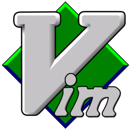
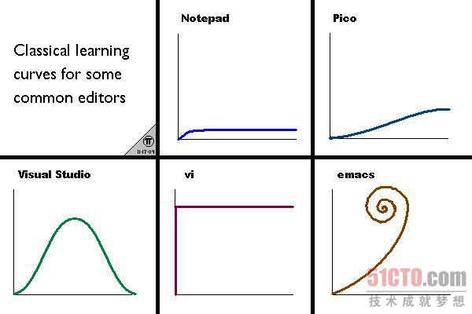

# Vim 简介      

> 世界上只有三种编辑器，Emacs、Vim和其他

**什么是Vim**    
一下两句对编辑器的评价足矣：    
* 据说Emacs是神的编辑器，而Vim是编辑器之神。
* Emacs is actually an OS which pretends to be an editor

官方一点的：   
**Vim** 是 Linux 系统上最著名的文本编辑器，也是早年的 Vi 编辑器的加强版，而 gVim 则是 Windows 版。它的最大特点是完全使用键盘命令进行编辑，脱离了鼠标操作，使其大大提高了效率，从而也使得它入门变得非常困难。

**为什么选择Vim**    
我们所处的时代是非常幸运的，有越来越多的编辑器，相对与古老的 **Vim** 和 Emacs，它们被称为现代编辑器，我们来看看两个古董的年龄：
* Emacs : 1975 ~ 2017 = 42岁
* Vi    : 1976 ~ 2017 = 41岁
* Vim   : 1991 ~ 2017 = 26岁

**Vim** 的学习曲线非常陡，以下是来自互联网的主流编辑器的学习曲线对比。   

既然学习 **Vim** 如此之难，我们为什么要花大量时间来学习这个老古董。下面我就简单列举了一些程序员期望使用的编辑器拥有的功能：   
* 轻量级，迅速启动(相对与IDE)   
* 特性   
    - 语法高亮
    - 自动对齐
    - 代码折叠
    - 自动补全
    - 显示行号
    - 重定义Tab
    - 十六进制编辑
    - 列模式编辑器
    - 快速注释
    - 高级搜索、替换
    - 错误恢复
    - 迅速跳转
    - Mark
* 美观也是一个方面  
> 首先，**Vim** 包含了上面列所有功能，并且远远多于此。并且，**Vim** 拥有让你不可抗拒的其他特性：   

1. 无止尽的扩展，现在 **Vim** 的官方网站上已经有了很多扩展，并且还在不断增加...
2. 完美的跨平台，Windows(gVim)、Linux(内置默认)、Mac(MacVim)   
3. 开源
4. **用起来很酷**  
5. ......

**黑客的编辑器**   
> 编程大师们的选择，也是 Emacs 和 **Vim** 被追捧为神器的原因。   

**Vim** 的前身作者 Bill Joy 和 Emacs 的作者 Richard Stallman 都是那个时代著名的黑客，所以这两款神器一开始都是面向写程序的人，现在仍然是，他们对编程加入了越来越多的支持，如语法高亮、只能缩进、关键是补全甚至集成调试。Linux 之父 Linus 多年来使用的是一款 MicroEmacs，微软的大牛 Don Box，Com 之父，一直使用Emacs，他说谁也不能夺走他的编辑器。跑题了，怎么好像全是在说 Emacs，本教程主要是**Vim** ......

**关于本教程** 

学习本教程，有一下前提条件：
* 对Vim有一定的了解。一无所知的请先自行百度
* 坚持...
* 坚持...
* 坚持...
* 坚持...
* ...

